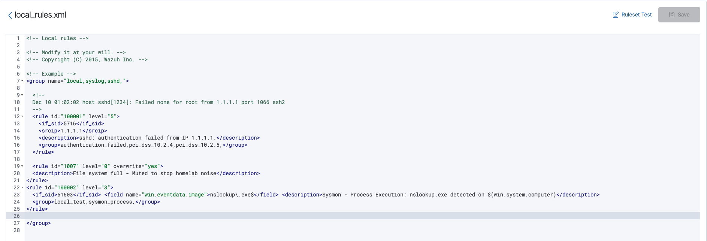
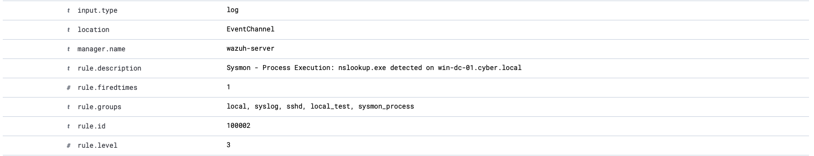
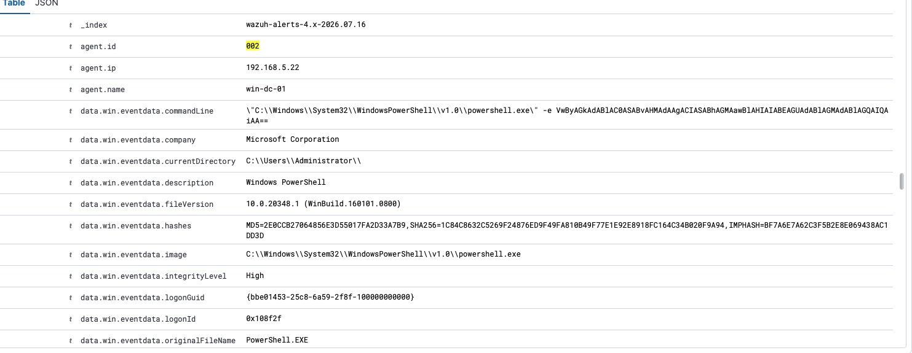
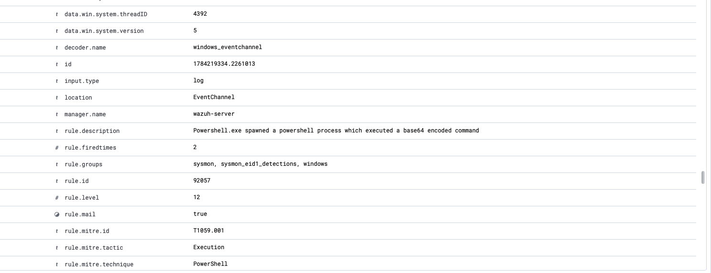
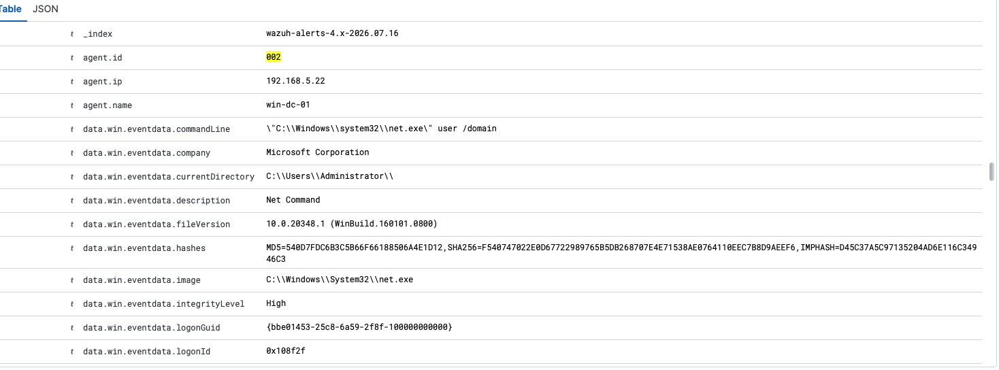
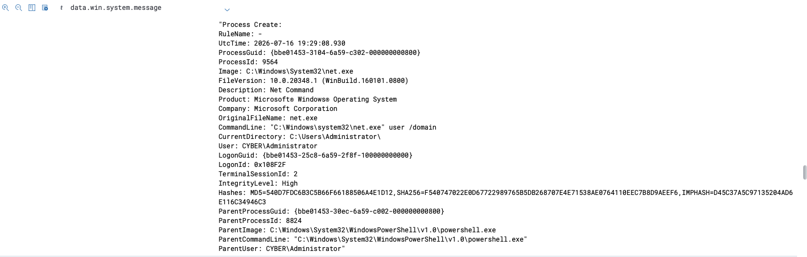
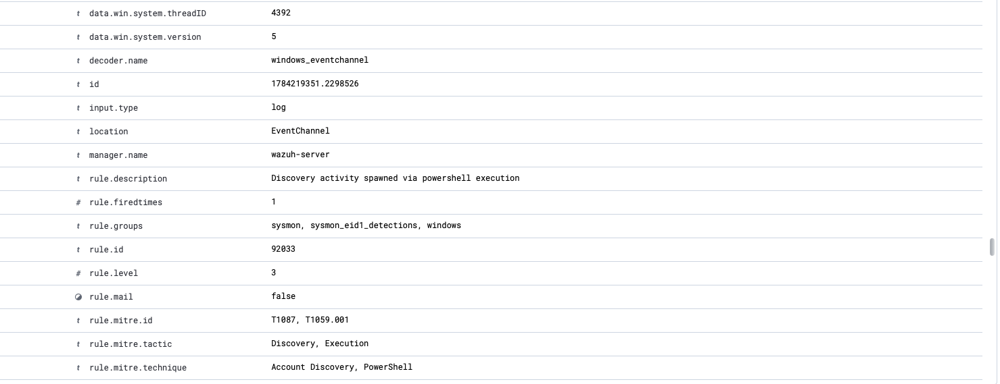

# 🛡️ Enterprise Home SOC Lab Journey

This repository documents the step-by-step engineering, deployment, and real-time monitoring of an isolated, enterprise-grade Security Operations Center (SOC) lab environment. Built entirely from the ground up on physical hardware, this environment serves as a practical sandbox for host-level telemetry engineering, custom threat detection rule development, Active Directory reconnaissance analysis, perimeter firewall access control, and structured incident response.

### 🧠 Key Skills & Technologies Demonstrated:
* **Perimeter Security & Networking:** pfSense Firewall routing, WAN RFC 1918 filtering, NAT Port Forwarding, zero-trust administrative isolation.
* **SIEM & Logging:** Wazuh Manager, custom Sysmon XML profiles, Elasticsearch/OpenSearch index management.
* **Systems & Security Engineering:** Proxmox VE hypervisor management, Linux LVM manipulation, Active Directory Domain Services (AD DS).
* **Detection Engineering:** Regex-based XML rule development (Sysmon Event ID tracking), PowerShell obfuscation analysis.
* **Threat Simulation & Incident Response:** Active reconnaissance analysis (MITRE ATT&CK T1087 mapping), Hydra brute-force analytics, and industry-compliant forensic reporting.

---

## 📋 Lab Specifications & Topology
Before diving into the phases, here is the hardware and software blueprint of the isolated SOC environment:

| Component | Role | OS / Platform | Resource Allocation |
| :--- | :--- | :--- | :--- |
| **Physical Host** | Hypervisor Node | Proxmox VE 8.x | Multi-core, DDR5 RAM, NVMe |
| **pfSense-FW** | Perimeter Firewall / Gateway | pfSense CE | 2 vCPU, 2GB RAM, 20GB Disk |
| **Wazuh-Manager** | SIEM / Central Analytics | Ubuntu Server 22.04 | 2 vCPU, 4GB RAM, 60GB Disk |
| **linux-target-01** | Linux Target Host | Ubuntu Server CLI | 2 vCPU, 2GB RAM, 32GB Disk |
| **windows-dc-01** | Active Directory Domain Controller | Windows Server 2022 | 2 vCPU, 4GB RAM, 50GB Disk |

---

## 🛠️ Phase 1: Physical Hypervisor Layer
* **Hardware Node:** Dedicated server platform equipped with multi-core processing, upgraded high-speed DDR5 RAM, and high-performance NVMe storage.
* **Hypervisor:** Proxmox VE (Virtual Environment).
* **Network Infrastructure:** Segmented virtual network topology designed for isolated asset management and safe threat simulation.

### 🧠 Key Engineering Hurdles Overcome:
* **The `Exit Code 100` Error:** Diagnosed a package manager failure during core updates. Successfully resolved it by disabling the restricted enterprise update streams and manually mapping the system to the community **No-Subscription** repository.

---

## 🖥️ Phase 2: Staging the Target Environment
* **Asset Name:** `linux-target-01`
* **Operating System:** Headless Ubuntu Server (CLI-only).
* **Resource Mapping:** 2 vCPU cores, 2GB RAM, 32GB NVMe Virtual Disk.
* **Local Tooling:** Installed `htop` via CLI to monitor live system processes, memory footprints, and baseline resource utilization.

📸 *[Screenshot 1: Target VM Resource Baseline via htop]*

---

## 📊 Phase 3: SIEM & Telemetry Deployment
* **SIEM Platform:** Wazuh Manager (Deployed on an independent Ubuntu Server VM).
* **Endpoint Detection:** Successfully deployed and activated the Wazuh Agent on `linux-target-01`, establishing a live telemetry pipeline back to the central dashboard.

### 🧠 Key Engineering Hurdles Overcome:
* **Elasticsearch/OpenSearch Database Lockdown:** Resolved a critical system failure where disk usage exceeded the flood-stage watermark, forcing the index into read-only mode. 
* **The Fix:** Expanded the Ubuntu LVM partition from 35GB to the full 60GB allocated in Proxmox, dropped the read-only block using the cluster settings API wrapper (`curl`), and permanently muted future storage noise by modifying `/var/ossec/etc/rules/local_rules.xml` to override Rule 1007 to `level="0"`.

---

## ⚔️ Phase 4: Active Threat Simulation & Detection
To validate the detection capabilities of the SIEM pipeline, an automated SSH Brute Force attack was executed from an external host within the network cluster.

* **Attacking Tool:** Hydra (Automated login cracker).
* **Attack Parameters:** Fired a targeted dictionary attack against the victim machine utilizing a custom password wordlist targeting a non-existent user (`super_hacker`).

### 📸 Incident Evidence & Telemetry Capture:

#### 1. The Attack Execution (The Incident)
This capture shows the external terminal leveraging Hydra to rapidly hammer the target endpoint with sequential password attempts.

#### 2. The SIEM Alarm Triggered (Dashboard Metrics)
Wazuh instantly identified the anomalous traffic, displaying a massive, real-time visual spike on the manager overview metrics.
* **Dashboard Overview (Trend View):** 
* **Dashboard Overview (Event Count):** 

#### 3. Deep Packet Forensic Analysis (The Investigation)
Drilling down into the raw log data fields (`data.srcuser` and `srcip`), the SIEM pinpointed the exact malicious username attempted (`super_hacker`) and unmasked the attacker's internal network origin.
* **Forensic Metadata Breakdown:** 
* **Source Network Mapping:** 

---

## 🗄️ Phase 5: Windows Domain Controller & Active Directory Integration
* **Asset Name:** `windows-dc-01` (Agent `002`)
* **Operating System:** Windows Server 2022
* **Resource Mapping:** 2 vCPU cores, 4GB RAM, 50GB NVMe Virtual Disk.
* **Role:** Active Directory Domain Services (AD DS) configured as the primary Domain Controller.
* **Telemetry Engine:** Wazuh Windows Agent + Microsoft Sysmon (System Monitor) with a customized configuration to capture rich endpoint and process creation telemetry.

---

## 🔍 Phase 6: Advanced Telemetry Engineering & Active Directory Recon Detection
With Windows telemetry reporting back to the Wazuh Manager, we simulated common enterprise attack vectors, evaluated system encoding mechanics, and engineered custom detection rules to capture stealth behaviors.

### 🧠 Key Engineering Hurdles Overcome:
* **Custom Sysmon Telemetry Ingestion:** Developed custom Wazuh rule `100002` to parse Sysmon Event ID 1 (Process Creation) logs, specifically targeting execution anomalies like `nslookup.exe` using precise regex anchors (`^1$`).
* **UTF-8 vs. UTF-16LE Encoding Anomalies:** Evaluated PowerShell execution mechanics under `-EncodedCommand`. Investigated how execution obfuscation conceals the malicious payload in standard logs and verified Sysmon's ability to pull down the raw, obfuscated Base64 attack string under native Wazuh Rule `92057`.

### 📸 Windows Telemetry & Simulation Evidence:

#### 1. Custom Rule Engineering
Injecting a custom rule into the local rules manager to bridge Sysmon Event ID 1 process telemetry with Wazuh's detection engine.
* **Local Rules Configuration (`local_rules.xml`):** 
* **Custom Nslookup Rule Triggered:** 

#### 2. Encoded PowerShell Payload Detection
Running a Base64-encoded command string, verifying Wazuh Rule `92057` caught the execution natively, and analyzing Sysmon's capture of the raw metadata.
* **Rule 92057 Alert Stream:** 
* **PowerShell Metadata Breakdown:** 

#### 3. Active Directory Reconnaissance & MITRE ATT&CK Mapping
Simulated internal account discovery using the `net user /domain` command on the Domain Controller. Discovered Windows process tree behavior (`net.exe` spawning `net1.exe` under the hood) and analyzed the automatic MITRE ATT&CK T1087 (Account Discovery) mapping inside the Wazuh console.
* **Net.exe Execution Alert:** 
* **Expanded Process Tree Details (net1.exe spawn):** 
* **MITRE ATT&CK T1087 (Account Discovery) Mapping:** 

---

## 🛡️ Phase 7: Virtual Network Boundary & Access Control Hardening (pfSense)
To transition the environment into a true isolated enterprise network, pfSense was deployed as the primary virtual boundary gateway controlling all ingress/egress transit.

* **Asset Name:** `pfSense-FW`
* **Operating System:** pfSense CE (FreeBSD)
* **Resource Mapping:** 2 vCPU cores, 2GB RAM, 20GB NVMe Virtual Disk.
* **Network Segmentation:** Configured dual-interface routing separating WAN transit from the internal isolated `10.0.50.0/24` lab network.

### ⚙️ Access Policy & NAT Control Topology:
* **Zero-Trust Administrative Management:** Restricted pfSense WebGUI access (`10.0.50.1`) strictly to internal LAN instances (accessed via the Windows VM jump box or Proxmox hypervisor console), preventing WAN management exposure.
* **Ingress NAT Port Forwarding:** Configured Port Forwarding on the WAN interface (TCP Port 22) to translate external management traffic directly to `linux-target-01` (`10.0.50.100`), enforcing boundary translation.

### 🧠 Key Engineering Hurdles Overcome:
* **RFC 1918 WAN Private Address Filtering:** Diagnosed packet drops caused by pfSense's default WAN security controls blocking private IP ranges (`192.168.x.x`). Disabled **`Block private networks and loopback addresses`** on the WAN interface to allow transit across the local physical network.
* **Service Port Collision Avoidance:** Identified and resolved system-level SSH listener port conflicts on pfSense, ensuring external SSH traffic cleanly passes through the firewall engine down to internal Linux targets.

---

## 📸 System Baseline & Snapshot Checkpoints
To establish a stable rollback foundation before initiating future firewall log forwarding and advanced attack scenarios, hypervisor-level snapshots were generated across all active nodes:

| Node | Snapshot Identifier | State Captured & Verified |
| :--- | :--- | :--- |
| **pfSense-FW** | `Baseline_WAN_NAT_Rules` | WAN unblock rules applied, Inbound SSH Port Forwarding verified, internal WebGUI secured. |
| **linux-target-01** | `Baseline_Netplan_SSH_Fixed` | Static IP (`10.0.50.100`), default route set via pfSense gateway (`10.0.50.1`), Wazuh Agent running. |
| **windows-dc-01** | `Baseline_Clean_State` | AD DS functional, Sysmon process telemetry streaming, RDP access active. |

---

## 📁 Documented Incident Reports
To match enterprise compliance standards, all verified threat simulations are operationalized into formal security documentation:
*   [INC-2026-0703: SSH Brute-Force Attack (Hydra Detection vs. Wazuh SIEM)](./reports/INC-2026-0703-Hydra-SSH.md) — *Status: Closed/Mitigated*

---

## 🚀 Next Horizons
* [x] Build out automated documentation templates for standardized incident response reports.
* [x] Expand the architecture to include a Windows Server VM.
* [x] Provision Active Directory (AD) to simulate enterprise identity management and monitor domain-level threat vectors.
* [x] Integrate pfSense as a virtual network-level boundary security device.
* [ ] Configure pfSense Syslog logging to ship perimeter firewall events directly into the Wazuh SIEM.
* [ ] Conduct multi-stage attack simulations across network boundaries and Active Directory assets.
