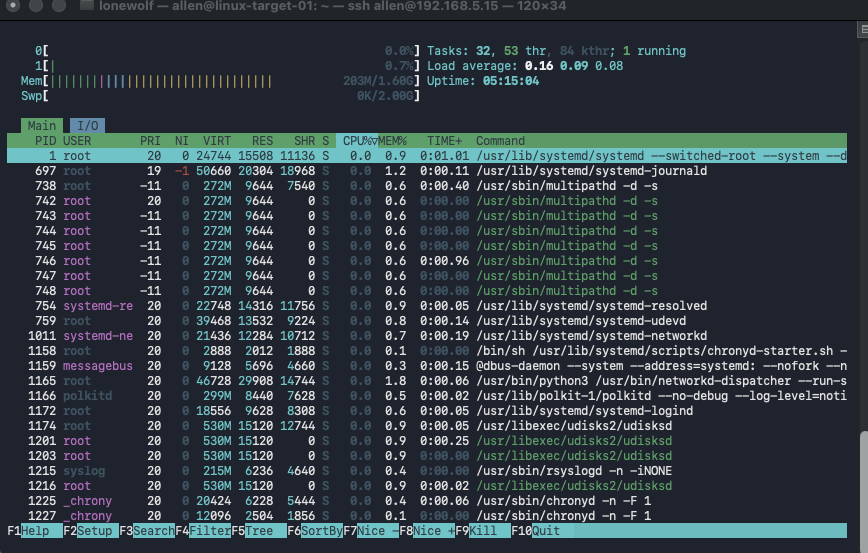
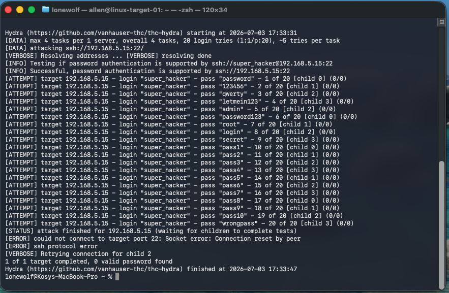
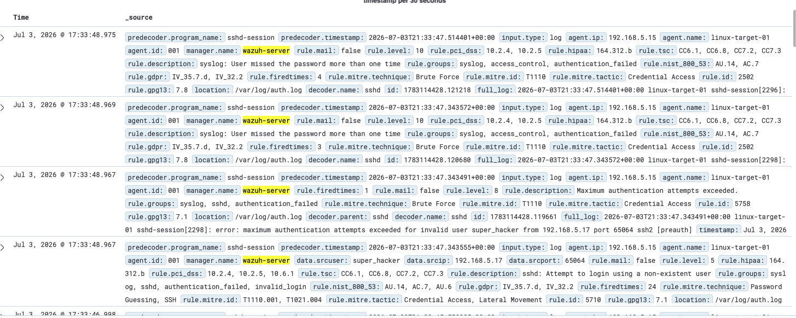
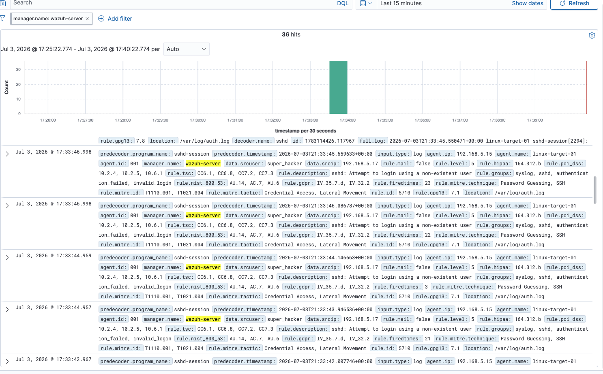
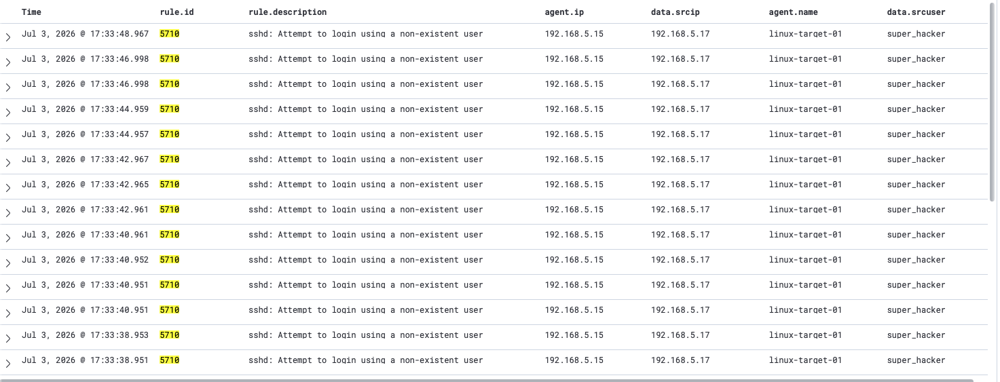
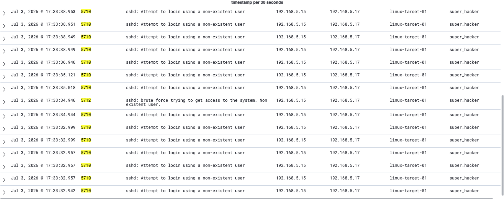

# 🛡️ Enterprise Home SOC Lab Journey

Welcome to my cybersecurity portfolio. This repository documents the step-by-step engineering, deployment, and real-time monitoring of an isolated Home Security Operations Center (SOC) lab environment built from the ground up using enterprise-grade open-source tooling.

---

## 🛠️ Phase 1: Physical Hypervisor Layer
* **Hardware Node:** Dedicated server platform equipped with multi-core processing, upgraded high-speed DDR5 RAM, and high-performance NVMe storage.
* **Hypervisor:** Proxmox VE (Virtual Environment).
* **Network Infrastructure:** Segmented virtual network topology designed for isolated asset management and safe threat simulation.

### 🧠 Key Engineering Hurdles Overcome:
* **The `Exit Code 100` Error:** Diagnosed a package manager failure during core updates. Successfully resolved it by disabling the restricted enterprise update streams and manually mapping the system to the community **No-Subscription** repository.

---

## 🖥️ Phase 2: Staging the Target Environment
* **Asset Name:** `linux-target-01`
* **Operating System:** Headless Ubuntu Server (CLI-only).
* **Resource Mapping:** 2 vCPU cores, 2GB RAM, 32GB NVMe Virtual Disk.
* **Local Tooling:** Installed `htop` via CLI to monitor live system processes, memory footprints, and baseline resource utilization.

📸 *[Screenshot 1: Target VM Resource Baseline via htop]*

---

## 📊 Phase 3: SIEM & Telemetry Deployment
* **SIEM Platform:** Wazuh Manager (Deployed on an independent Ubuntu Server VM).
* **Endpoint Detection:** Successfully deployed and activated the Wazuh Agent on `linux-target-01`, establishing a live telemetry pipeline back to the central dashboard.

### 🧠 Key Engineering Hurdles Overcome:
* **Elasticsearch/OpenSearch Database Lockdown:** Resolved a critical system failure where disk usage exceeded the flood-stage watermark, forcing the index into read-only mode. 
* **The Fix:** Expanded the Ubuntu LVM partition from 35GB to the full 60GB allocated in Proxmox, dropped the read-only block using the cluster settings API wrapper (`curl`), and permanently muted future storage noise by modifying `/var/ossec/etc/rules/local_rules.xml` to override Rule 1007 to `level="0"`.

---

## ⚔️ Phase 4: Active Threat Simulation & Detection
To validate the detection capabilities of the SIEM pipeline, an automated SSH Brute Force attack was executed from an external host within the network cluster.

* **Attacking Tool:** Hydra (Automated login cracker).
* **Attack Parameters:** Fired a targeted dictionary attack against the victim machine utilizing a custom password wordlist targeting a non-existent user (`super_hacker`).

### 📸 Incident Evidence & Telemetry Capture:

#### 1. The Attack Execution (The Incident)
This capture shows the external terminal leveraging Hydra to rapidly hammer the target endpoint with sequential password attempts.

#### 2. The SIEM Alarm Triggered (Dashboard Metrics)
Wazuh instantly identified the anomalous traffic, displaying a massive, real-time visual spike on the manager overview metrics.
* **Dashboard Overview (Trend View):** 
* **Dashboard Overview (Event Count):** 

#### 3. Deep Packet Forensic Analysis (The Investigation)
Drilling down into the raw log data fields (`data.srcuser` and `srcip`), the SIEM pinpointed the exact malicious username attempted (`super_hacker`) and unmasked the attacker's internal network origin.
* **Forensic Metadata Breakdown:** 
* **Source Network Mapping:** 

---

## 📁 Documented Incident Reports
To match enterprise compliance standards, all verified threat simulations are operationalized into formal security documentation:
*   [INC-2026-0703: SSH Brute-Force Attack (Hydra Detection vs. Wazuh SIEM)](./reports/INC-2026-0703-Hydra-SSH.md) — *Status: Closed/Mitigated*

---

## 🚀 Next Horizons
* [x] Build out automated documentation templates for standardized incident response reports.
* [ ] Expand the architecture to include a Windows Server VM.
* [ ] Provision Active Directory (AD) to simulate enterprise identity management and monitor domain-level threat vectors.
